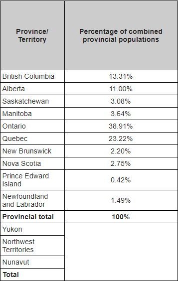
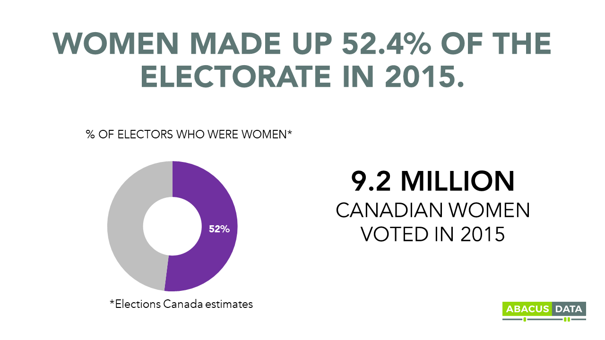
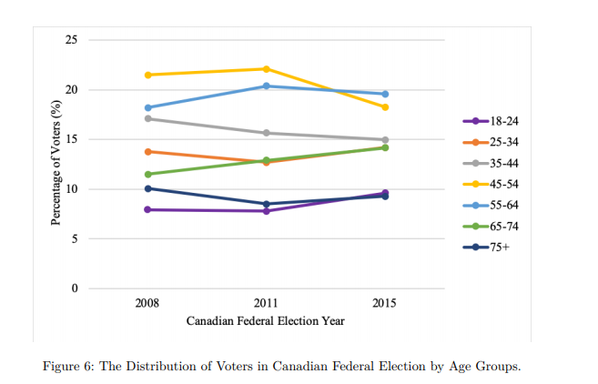
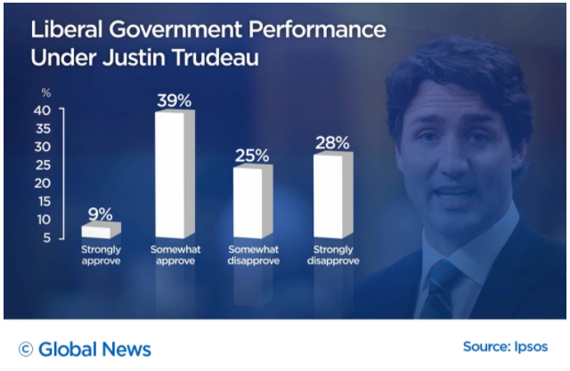
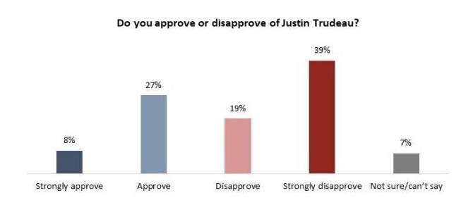

```{r setup, include=FALSE}
knitr::opts_chunk$set(echo = TRUE)
library(dplyr)
library(knitr)
library(ggplot2)
library(tidyverse)
library(scales)
library(kableExtra)

```

## Abstract
Based on the 2019 Canadian election study (Phone survey) data set, we use five variables which are the satisfaction of the federal government under Justin Trudeau, feeling about Justin Trudeau, gender, age and the province living in to investigate whether these factors influence a person choice of voting the Liberal Party or the Conservative Party. In order to accomplish it, We use two logistic regression models to analyze these factors and determine if they are the cases which affect people's vote choice for the Liberal Party or the Conservative Party. We get the conclusion that the four variables which are the satisfaction of the federal government under Justin Trudeau, feeling about Justin Trudeau, gender and age affect a person's choice to vote for the Liberal while as four variables which are feeling about Justin Trudeau, gender, age and the province affect a person's choice to vote for the Conservative Party. Our results are crucial because we provide the information for both parties and tell them what factors have influences on their election. It is important for both parties to evaluate themselves and know their pros and cons so that we will have more chance to win the upcoming election. 


## Introduction

On October 21, 2019, Canada had its 2019 Canadian federal election. The Liberal Party has lost the majority of seats they had won in 2015; won 157 seats to form a minority government incumbent by Prime Minister Justin Trudeau. The Conservatives obtained 121 seats by Andrew Scheer, an increase from collecting 95 seats in 2015, while the NDP concluded with 24 seats in total.

Whilst researching, in a minority situation, governments must rely on the support of other parties to stay in power, providing less stability than a majority government. At the federal level, no minority government (excepting the odd case of the 14th) has lasted a standard four-year term. Most minority governments
have lasted less than two years. The average duration of minorities in Canada they have completed is 479 days or approximately 1 year, 140 days counting only that part of the 14th Parliament that was a minority, or 1 year, 207 days counting the entire duration of it. 

According to historical trends, I predict that there will be another Canadian federal election coming in March, 2021. The Conservatives Party has changed party leader to Erin O’Toole after Andrew Scheer resigned in late 2019 while the leader of the Liberal Party and the NDP remain the same. Could Erin O’Toole beat Justin Trudeau to win more seats in Parliament or can Justin Trudeau win the election back to a majority government just as in 2015. No one can tell, but we can predict by information, observation, and a recurrence of prior events.

There are an abundance of factors for people who care about the votes, it can influence and alter the public’s decision of voting when it comes to the federal election. Some people might care about the environment, meanwhile others lean towards civic rights more. Parents may care about providing a better education system for the youth, while seniors yearn for increased retirement benefits. Different provinces have their own issues; different genders have different ways of thinking. I know some friends who voted for a party leader they chose because they liked either the leader's personality, view point on certain topics of interest or by the leader's appearance.

I collected from the 2019 Canadian Election results data to do an investigation, finding out different factors that could influence people’s choice to vote. I identified five variables that I thought were influential. 

1.	Satisfaction of the federal government
2.	Feelings about Justin Trudeau
3.	Gender
4.	Age
5.	Province

I chose logistic regression to conduct the analysis in this report, those five variables above are categorical variables. I used the P-values of the different variables to verify if an individual voter for the Liberal Party or the Conservatives Party that could be influenced. 

From the work I have accumulated, the results which I got could determine the 2019 Canadian Election results data set is very useful. Those information provided can be used for the Canadian federal parties to well prepare for their policy to meet the interests of voters in different groups. I am going to discuss more details regarding the data set and model in this report. 

## Data

The data was collected by the 2019 Canadian federal election phone survey. This was completed by Advanis on behalf of Western University. The survey has more than 100 questions but we will only focus on the question 2, 3, 4, 11, 13 and 20 to investigate whether a respondent will vote for the Liberal Party or the Conservative Party by giving the information: the satisfaction of the federal government under Justin Trudeau, feeling about Justin Trudeau, gender, age and province living in. 
Table 1 indicates the responses from the first couple of respondents with five variables. The data will be like in the following:

```{r CODE, tidy =FALSE, echo =FALSE, warning= FALSE}
survey_data <- read.csv("C:/Users/lumuc/Desktop/final 304/cleaned_data.csv") #read in the data
survey_data <- survey_data %>% #Select variables of interest 
  select(q20,
         q11,
         q13,
         q3,
         q2,
         q4
         )
# creating head of the variables for the model 1
Table1 <- head(survey_data) %>% 
  kable(align = "c",
        format = "simple",
        col.names = c("q20", "q11", "q13", "q3", 
                      "q2", "q4"),
        ) %>% 
  kable_styling(font_size = 5)
  

Table1
```


The collection of data started on September 10, 2019 (after the election was called) and concluded on the eve of the election on October 20, 2019. 
The way to reach the respondent is following: Sample records were prioritized so that we would call previously dialed sample first until we reached a minimum of 6 attempts. A single message was left for each respondent if we were directed to their voicemail. Once 6 attempts had been made for a sample record without an eligible respondent being reached, the sample record was retired and a new sample record randomly selected to be called. If an eligible respondent was reached who requested a call back, a minimum of 4 further attempts were conducted to complete an interview after the initial contact. Also, towards the end of data collection, the minimum number of attempts was increased to minimize the volume of new sample being selected for calling.
The second stage of the sample selection process was to determine the eligibility of the person answering the phone and, the random selection of a respondent from the selected household. To be eligible for the interview the respondent had to be an adult (18 years of age or older) and a Canadian citizen. If there was more than one eligible person in the household at a phone number, the person with the next birthday was requested as the survey respondent.

THe strength of this survey is that high technologies were used during the interview. The telephone data collection was completed with Computer Assisted Telephone Interviewing (CATI). Computer-assisted telephone interviewing (CATI) is a telephone surveying technique in which the interviewer follows a script provided by a software application. It is a structured system of microdata collection by telephone that speeds up the collection and editing of microdata and also permits the interviewer to educate the respondents on the importance of timely and accurate data. 

The methodology and approach that is the birthday selection method. It is very important because the birthday selection method to ensure a random selection of respondents and is a much less intrusive way to start an interview than asking about the number of people in the household, thus making it easier for the interviewer to secure the respondent’s cooperation. The dual-frame-with-overlap approach is also being used in the survey. It is one of the most widely-used approach for general population modified random digit dialling. The “with overlap” methodology treats the landline and wireless samples like “traditional” CATI samples, keeping everyone that qualifies. Lastly, the simply random selection is used as randomly selecting a respondent from the selected household.

The target population of this survey are Canadian citizens 18 years of age or older who reside in one of the ten Canadian provinces (thus excluding the territories).
Because the survey was conducted by telephone, the small proportion of households in Canada without landline or wireless telephones were excluded from the population. This removes the chance of those people who do not use a phone or do not have a landline, also who live in the Canadian territories, such as the aboriginals to be sampled. These exclusion causes the biases because these who are removed from the target population live in different lifestyles and they will have different political preferences compared to the average respondents.

The frame for the Canadian Election Study is all telephone numbers in Canada consist of an area code, a “central office code” or exchange (the first
three digits of the telephone number), and a suffix or “bank” (the last four digits of the number). As mentioned before, we already know the way how to reach the respondents but this might cause some biasesalong the way. Different family members would have different political preferences even if they live together, and those people who did not pick up the phone in time will not be included and missed the chance as the frames. 

During the election campaign, telephone interviews were completed with 4,021 Canadian citizens and the sample will be 4,021 Canadian citizens.

In the next following, we will use all the 4021 Canadian citizens responses as the data set in our report and apply models to get some interesting results. 

## Model 1
The model 1 we use is logistic regression. We're interested in variables, like the satisfaction of the federal government, feeling about Justin Trudeau, gender, age and province living in influence a person's decision to vote the Liberal Party. The response variable is whether a person decides to vote for the Liberal Party,and it is a categorical variable with two levels: 0 means not voting for the Liberal Party and 1 means voting for the Liberal Party. The explanatory variables are the satisfaction of the federal government, feeling about Justin Trudeau, gender, age and province living in these 5 variables. They are also categorical variables and the benefits of using categorical variable is that they can directly tell us a person's information and it makes us easier to justify which category it belongs to. It represent the data better and have a more intuitive interpretation for displaying results. For example, we divide the age into four different categories: 18-24, 24-44, 45-64, and 65+. It is convenient to organize the data and save us a lot of time instead of getting the actual age of a person. Also, we do not necessarily need to know the actual age of a person because age groups can tell us different people's vote choices in the election when they are in their different stages of life time.

Logistic regression enables us to easily analyze categorical response variables, combining numerical values and categorical explanatory variables. It estimates the probability of a binary response, based on one or more predictor variables. A wide range of alternatives are available from statistics-based procedures (e.g. log binomial, ordinary or modified Poisson regression and Cox regression). For example, tree-based methods are a good alternative. Overall, We can see two main advantages of using the logistic regression model. The first is you can include more than one explanatory variable and those can either be dichotomous, ordinal, or continuous. The second is that logistic regression provides a quantified value for the strength of the association adjusting for other variables.

The reason we choose logistic regression model is that this model gives us the appropriate regression analysis to conduct when the dependent variable is binary since the dependent variable can either be 0 or 1. In general, our model is logistic regression model but more specifically, it is a multiple logistic regression whose analysis applies when there is a single dichotomous outcome and more than one independent variable. 

Logistic regression estimates $\beta_0...\beta_k$ in the following equation:
$$
log(\frac{p}{1-p})=\beta_0+\beta_1x_1+...+\beta_kx_k
$$
where p is the probability of event A that we are interested in, $\beta_0$is the intercept, $x_1...x_K$ are our variables of interest and $\beta_1...\beta_k$ are parameters for each of these variables. Based on the result, we are able to estimate p for a particular case given all the variables.

In our case, we want to estimate $\beta_{satisfactionofgovernment},\beta_{feelaboutJT},\beta_{gender},\beta_{age},\beta_{province}$ in:
$$
log(\frac{p}{1-p})=\beta_0+\beta_{satisfactionofgovernment}x_{satisfactionofgovernment}+\beta_{feelaboutJT}x_{feelaboutJT}
$$
$$
+\beta_{gender}x_{gender}+\beta_{age}x_{age}+\beta_{province}x_{province}
$$
where p is the probability that a person votes the liberal party, $\beta_0$ is the intercept, $\beta_{satisfactionofgovernment}$ is the parameter for the satisfaction of the federal government under Justin Trudeau, $\beta_{feelaboutJT}$ is the parameter for how people feel about Justin Trudeau, $\beta_{gender}$ is the parameter for gender and $\beta_{age}$ is the parameter for age and $\beta_{province}$ is the parameter for province people living in.

We use 'GLM ()' function in the 'Stats' package in' R 'to adapt the model to our data. 


```{r, include = FALSE}
#logistic regression for model 1
my_logit <- glm(
  q11 ~ q13 + q20 + q3 + q2 + q4,
  data = survey_data, family = "binomial"
)

```

## Results 1

```{r, tidy =FALSE, echo =FALSE, warning= FALSE}
#creating the summary table for model 1
my_log_res <- data.frame(
  variable = c("intercept","q13(2) Fairly satisfied", "q13(3) Not very satisfied ", "q13(4) Not satisfied at all", "q20good", "q20ok", "q20perfect", "q3(2) Female", "q225-44", "q245-64","q265+", "q4(10) British Columbia","q4(2) Prince Edward Island","q4(3) Nova Scotia","q4(4) New Brunswick","q4(5) Quebec","q4(6) Ontario","q4(7) Manitoba","q4(8) Saskatchewan","q4(9) Alberta"),#list of all variable names including levels
  estimate = c(-0.44676, -0.85429, -2.50036, -3.93136, 2.08188, 1.13344, 2.83283, -0.28391, 0.27460, 0.46157, 0.59622, -0.51735,-0.21058,-0.42614,-0.42943,-0.12663,0.17115,-0.09502,-0.77834,-0.52966),# list of estimate results
  pvalue = c("0.34184", "0.00398**", "1.63e-14***","< 2e-16***","< 2e-16***","2.01e-08***","< 2e-16***","0.01593*","0.22178","0.03850*","0.01105*","0.07172.","0.55844","0.22493","0.23468","0.66053","0.54715","0.78475","0.04019*","0.16239" )# list of p values
)
kable(my_log_res, caption = "Summary of Losgistic Estimates", 
      label = "CES 2019 phone survey")
```

In an equation, this means 
$$
log(\frac{\hat{p}}{1-\hat{p}})=\hat{\beta_0}+\hat{\beta}_{fairlysatisfied}x_{fairlysatisfied}+\hat{\beta}_{Notverysatisfied}x_{Notverysatisfied}+
\hat{\beta}_{Notsatisfiedatall}x_{Notsatisfiedatall}
$$

$$
+\hat{\beta}_{good}x_{good}+\hat{\beta}_{ok}x_{ok}+\hat{\beta}_{perfect}x_{perfect}+\hat{\beta}_{Female}x_{Female}+\hat{\beta}_{25-44}x_{25-44}+\hat{\beta}_{45-64}x_{45-64}+\hat{\beta}_{65+}x_{65+}
$$

$$
+\hat{\beta}_{BC}x_{BC}+\hat{\beta}_{PEI}x_{PEI}+\hat{\beta}_{NS}x_{NS}+\hat{\beta}_{NB}x_{NB}+\hat{\beta}_{Quebec}x_{Quebec}+\hat{\beta}_{Ontario}x_{Ontario} 
$$
$$
+\hat{\beta}_{Manitoba}x_{Manitoba}+\hat{\beta}_{Saskatchewan}x_{Saskatchewan}+\hat{\beta}_{Alberta}x_{Alberta}
$$

Since we have used the categorical variables to represent the data. “fairlysatisfied”, “Notverysatisfied”, “Notsatisfiedatall” represent the four different satisfaction to the federal government categories; "good”,  "ok" and "perfect" describe the four attitudes towards Justin Tredeau ; "25-44" and "45-64" and "65+" represent the four age groups. "BC","PEI","NS","NB","Quebec","Ontario","Manitoba","Saskatchewan", "Alberta" represent 10 provinces that people who are living in British Columbia, Prince Edward Island, Nova Scotia, New Brunswick, Quebec, Ontario, Manitoba, Saskatchewan and Alberta respectively. "Female" represent the two
categories for gender.

The model predicts the result for the probability a person votes for the Liberal Party p, rounded to three decimal places. Since log is an one to one function with p, we say the change on $log(\frac{\hat{p}}{1-\hat{p}})$ is isomorphic to any change on p, the probability that a person in Canada votes for the Liberal Party. 

$$
log(\frac{\hat{p}}{1-\hat{p}})= -0.447 -0.854x_{fairlysatisfied}-2.500x_{Notverysatisfied}-3.931x_{Notsatisfiedatall}+2.081x_{good}+1.133x_{ok}+2.833x_{perfect}
$$

$$
-0.284x_{Female}+0.275x_{25-44}+0.462x_{45-64}+0.596x_{65+}-0.517x_{BC}-0.211x_{PEI}-0.426x_{NS}-0.429x_{NB}-0.127x_{Quebec}
$$

$$
+0.171x_{Ontario}-0.095x_{Manitoba}-0.778x_{Saskatchewan}-0.529x_{Alberta}
$$

The interpretation of the categorical variables’ prediction results is comparing it to a certain level that is not in the equation above. A $\hat{\beta}_{25-44} = 0.275$ does not mean the coefficient for having an age in the interval 25-44 is 0.275. It represents the difference of influence (on vote for liberal party decision) between having an age is 25-44 and having an age is 18-24. 0.275 indicates that having an age from 25 to 44 is more likely to vote for the Liberal than having an age is 18-24 if it is influential at all depending on the p-value.

Using $\alpha = 0.05, H_0: \hat{\beta} = 0, \hat{\beta} \neq0$, 
the p values indicate weak evidence that having a age in 25-44 age group affects a person's probability of voting for liberal party. At the same time, it is evident that other age groups do influence the probability. A p-value of 0.228 > 0.05 indicates weak evidence to reject $H_0$; therefore, we cannot say staying in 25-44 age group influences a person's probability of voting for the liberal. However, staying in 45-64 age group and 65+ age group have influences on a person's probability of voting for the Liberal since p-value of 45-64 is 0.038 < 0.05 and p-value of 65+ is 0.011 < 0.05 in order to reject the null hypothesis. We can also conclude that having older age is more likely to vote for the Liberal Party because the coefficient of 65+ which is 0.596 is larger than the coefficient of 45-64 which is  0.275.

There is no evidence that living in province like British Columbia, Prince Edward Island, Nova Scotia, New Brunswick, Quebec, Ontario, Manitoba and Alberta have influences on p because their p values are bigger than 0.05. There is evidence that living in Saskatchewan variables influences p but its p-value is 0.040 which is very close to 0.05 but we don't consider it because p-value 0.04 means there is 50 percent probability of incorrectly rejecting a true null hypothesis and all other province shows no evidence of connection. 

Having a higher satisfaction towards the federal government performance under Justin Trudeau is more likely to vote for the Liberal Party in 2019 federal election by comparing the coefficient of fairly satisfied which is -0.85, not very satisfied which is -2.50 and not satisfied at all which is -3.93. Same for the "how people feel about Justin Trudeau" variable. The higher rates that people give to Justin Trudeau, the more likely they will vote for the Liberal party 2019 whose leader is still him by comparing the coefficient of ok which is  1.13, good which is 2.08 and perfect which is 2.83. The lower the satisfaction towards the federal government or the lower rate for Justin Trudeau, the less chance of a person voting for the Liberal Party.


As we know, five parties had representatives elected to the federal parliament in the 2019 election: the Liberal Party who currently form the government, the Conservative Party who are the Official Opposition, the New Democratic Party, the Bloc Québécois, and the Green Party of Canada. The most two dominant party are the
Liberal Party and the Conservative Party. It makes me think that will the result still the same if we keep the five variables unchanged, and investigate what factors influence a person’s choice to vote for the Conservative Party?


```{r code, tidy =FALSE, echo =FALSE, warning= FALSE}
survey_data_2 <- read.csv("C:/Users/lumuc/Desktop/final 304/cleaned_data_2.csv") #read in the data
survey_data_2 <- survey_data_2 %>% #Select variables of interest 
  select(q11,
         q20,
         q13,
         q3,
         q2,
         q4)

# creating the head of the variables in model 2
table2 <- head(survey_data_2) %>% 
  kable(align = "c",
        format = "simple",
        col.names = c("q20", "q11", "q13", "q3", 
                      "q2", "q4"),
        ) %>% 
  kable_styling(font_size = 5)
  
table2

```


## Model 2
The model 1 we use is logistic regression. We're interested in variables, like the satisfaction of the federal government, feeling about Justin Trudeau, gender, age and province living in influence a person's decision to vote the Liberal Party. The response variable is whether a person decides to vote for the Liberal Party,and it is a categorical variable with two levels: 0 means not voting for the Liberal Party and 1 means voting for the Liberal Party. The explanatory variables are the satisfaction of the federal government, feeling about Justin Trudeau, gender, age and province living in these 5 variables. They are also categorical variables and the benefits of using categorical variable is that they can directly tell us a person's information and it makes us easier to justify which category it belongs to. It represent the data better and have a more intuitive interpretation for displaying results. For example, we divide the age into four different categories: 18-24, 24-44, 45-64, and 65+. It is convenient to organize the data and save us a lot of time instead of getting the actual age of a person. Also, we do not necessarily need to know the actual age of a person because age groups can tell us different people's vote choices in the election when they are in their different stages of life time.

Logistic regression enables us to easily analyze categorical response variables, combining numerical values and categorical explanatory variables. It estimates the probability of a binary response, based on one or more predictor variables. A wide range of alternatives are available from statistics-based procedures (e.g. log binomial, ordinary or modified Poisson regression and Cox regression). For example, tree-based methods are a good alternative. Overall, We can see two main advantages of using the logistic regression model. The first is you can include more than one explanatory variable and those can either be dichotomous, ordinal, or continuous. The second is that logistic regression provides a quantified value for the strength of the association adjusting for other variables.
 
The reason we choose logistic regression model is that this model gives us the appropriate regression analysis to conduct when the dependent variable is binary since the dependent variable can either be 0 or 1. In general, our model is logistic regression model but more specifically, it is a multiple logistic regression whose analysis applies when there is a single dichotomous outcome and more than one independent variable.

Logistic regression estimates $\beta_0...\beta_k$ in the following equation:
$$
log(\frac{k}{1-k})=\beta_0+\beta_1x_1+...+\beta_kx_k
$$
where k is the probability of event B that we are interested in, $\beta_0$is the intercept, $x_1...x_K$ are our variables of interest and $\beta_1...\beta_k$ are parameters for each of these variables. Based on the result, we are able to estimate p for a particular case given all the variables.

In this case, we want to estimate $\beta_{satisfactionofgovernment},\beta_{feelaboutJT},\beta_{gender},\beta_{age},\beta_{province}$ in:
$$
log(\frac{k}{1-k})=\beta_0+\beta_{satisfactionofgovernment}x_{satisfactionofgovernment}+\beta_{feelaboutJT}x_{feelaboutJT}+\beta_{gender}x_{gender}
$$

$$
+\beta_{age}x_{age}+\beta_{province}x_{province}
$$

where k is the probability that a person votes the Conservative party, $\beta_0$ is the intercept, $\beta_{satisfactionofgovernment}$ is the parameter for the satisfaction of the federal government under Justin Tredeau, $\beta_{feelaboutJT}$ is the parameter for how people feel about Justin Trudeau, $\beta_{gender}$ is the parameter for gender and $\beta_{age}$ is the parameter for age and $\beta_{province}$ is the parameter for province people living in.

The 'GLM ()' function is used in the 'Stats' package in' R 'to adapt the model to our data. . 


```{r, include = FALSE}
#logistic regression
my_logit_2 <- glm(
  q11 ~ q13 + q20 + q3 + q2 + q4,
  data = survey_data_2, family = "binomial"
)

```

## Results 2

```{r, tidy =FALSE, echo =FALSE, warning= FALSE}
#creating the summary table 2 for model 2
my_log_res_2 <- data.frame(
  variable = c("intercept","q13(2) Fairly satisfied", "q13(3) Not very satisfied ", "q13(4) Not satisfied at all", "q20good", "q20ok", "q20perfect", "q3(2) Female", "q225-44", "q245-64","q265+", "q4(10) British Columbia","q4(2) Prince Edward Island","q4(3) Nova Scotia","q4(4) New Brunswick","q4(5) Quebec","q4(6) Ontario","q4(7) Manitoba","q4(8) Saskatchewan","q4(9) Alberta"),#list of all variable names including levels
  estimate = c(-16.0060, 14.3344, 15.5322, 16.3945, -2.0863, -1.0598, -2.6234, -0.4391, 0.2575, 0.6220, 0.8330, -0.0586,0.5375,0.4372,0.8404,-0.5310,0.3143,0.8074,1.1135,1.6632),# list of estimate results
  pvalue = c("0.958898", "0.963187", "0.960114","0.957901","< 2e-16 ***","1.18e-11 ***","4.91e-09 ***","9.96e-05 ***","0.251542","0.004698 **","0.000325 ***","0.839638","0.149051","0.234645","0.022204 *","0.078600 .","0.280948","0.014025 *","0.000763 ***","8.16e-07 ***" )# list of p values
)
kable(my_log_res_2, caption = "Summary of Losgistic Estimates", 
      label = "CES 2019 phone survey")
```
In this equation, this means 
$$
log(\frac{\hat{k}}{1-\hat{k}})=\hat{\beta_0}+\hat{\beta}_{fairlysatisfied}x_{fairlysatisfied}+\hat{\beta}_{Notverysatisfied}x_{Notverysatisfied}+
\hat{\beta}_{Notsatisfiedatall}x_{Notsatisfiedatall}
$$

$$
+\hat{\beta}_{good}x_{good}+\hat{\beta}_{ok}x_{ok}+\hat{\beta}_{perfect}x_{perfect}+\hat{\beta}_{Female}x_{Female}+\hat{\beta}_{25-44}x_{25-44}+\hat{\beta}_{45-64}x_{45-64}+\hat{\beta}_{65+}x_{65+}
$$

$$
+\hat{\beta}_{BC}x_{BC}+\hat{\beta}_{PEI}x_{PEI}+\hat{\beta}_{NS}x_{NS}+\hat{\beta}_{NB}x_{NB}+\hat{\beta}_{Quebec}x_{Quebec}+\hat{\beta}_{Ontario}x_{Ontario} 
$$

$$
+\hat{\beta}_{Manitoba}x_{Manitoba}+\hat{\beta}_{Saskatchewan}x_{Saskatchewan}+\hat{\beta}_{Alberta}x_{Alberta}
$$

Since we have used the categorical variables to represent the data again. “fairlysatisfied”, “Notverysatisfied”, “Notsatisfiedatall” represent the four different satisfaction to the federal government categories; "good”,  "ok" and "perfect" describe the four attitudes towards Justin Trudeau ; "25-44" and "45-64" and "65+" represent the four age groups. "BC","PEI","NS","NB","Quebec","Ontario","Manitoba","Saskatchewan", "Alberta" represent 10 provinces that people who are living in British Columbia, Prince Edward Island, Nova Scotia, New Brunswick, Quebec, Ontario, Manitoba, Saskatchewan and Alberta respectively. "Female" represent the two
categories for gender.

The model predicts the following result for the probability a person votes for the Conservative Party k, rounded to three decimal places. Since log is an one to one function with k, we say the change on $log(\frac{\hat{k}}{1-\hat{k}})$ is isomorphic to any change on k, the probability that a person in Canada votes for the Conservative Party. 

$$
log(\frac{\hat{k}}{1-\hat{k}})=-16.006+14.334x_{fairlysatisfied}+15.532x_{Notverysatisfied}+16.395x_{Notsatisfiedatall}-2.086x_{good}-1.059x_{ok}
$$

$$
-2.623x_{perfect}-0.439x_{Female}+0.257x_{25-44}+0.622x_{45-64}+0.833x_{65+}-0.059x_{BC}+0.538x_{PEI}+0.437x_{NS}+0.840x_{NB}
$$

$$
-0.531x_{Quebec}+0.314x_{Ontario}+0.314x_{Manitoba}+1.114x_{Saskatchewan}+1.663x_{Alberta}
$$

There is strong evidence that living in province like New Brunswick, Manitoba, Saskatchewan and Alberta have influences on p because their p values much less than 0.05. By comparing the coefficient of these provinces, living in Alberta provinces has the highest chance of voting for the Conservative Party with the coefficient of 1.6632. Followed by Saskatchewan, New Brunswick and Manitoba with the coefficients of 1.114, 0.840 and 0.807. There is weak evidence that living in provinces like British Columbia, Prince Edward Island, Nova Scotia, Quebec and Ontario have influences p because their p-value is smaller than 0.05.

The four different attitudes which are very satisfied, fairly satisfied, not very satisfied and not satisfied at all towards the federal government do not show evidences to affect the probability of a person voting for the Conservative Party because their p-values are much larger than 0.05.

However, the variable how people feel about Justin Trudeau does show a significant influence on the probability of a person voting for the Conservative Party. Having a bad rate for Justin Trudeau has the highest chance of voting for the Conservative with the coefficient of o while as having a perfect rate for Justin Trudeau has the least chance of support the Conservative with a coefficient of -2.623. 

Having a age in the 45-64 age group and 65+ age group have influence on a person of voting for the Conservative Party since their p-value is much less than 0.05. With the growth of ages, people tend to vote for the Conservative Party with the increase of coefficients.

Female are less likely to vote for the Conservative Party compared to male because the coefficient of female is -0.439.

## Discussion

The 2019 federal election phone survey data has shown that there are significant effects on a person's choice to vote for the Liberal Party or the Conservative Party by satisfaction of the federal government under Justin Trudeau, feel about Justin Trudeau, gender, age, province living in. This data can be useful for two parties to identify their protential supporters and also urge the federal government do a better service for people.

Firstly, People who live in New Brunswick, Manitoba, Saskatchewan and Alberta province are more likely to vote for the Conservative party compared to other provinces. 
The reasons that people live in these four provinces prefer to vote the Conservative Party is the following: For Alberta, the Conservative party has taken Alberta almost entirely back to blue amid frustrations over pipeline construction and federal oil and gas policy, as the Liberal party lost all of the gains it made in Alberta in 2015. For New Brunswick, some districts are royal to the Conservative Party and their people are vote for the Conservative Party by tradition. In its 102-year history of the southern New Brunswick district, it elected a Liberal only twice. For Manitoba, Liberals is not a presence in Manitoba. Here’s why. Manitoba is a two-party system, with the NDP and the Conservatives regularly trading power in government. They tend to be “big tent” when it comes to policy ideas. Both parties at times straddle the centrist space left by having no competitive Liberal party. Because of the relative weakness of the Liberals, many liberal-minded individuals with political aspirations have either gone to the NDP or the Conservatives. For Saskatchewan, there is a swing to the Conservatives began in the 2006 federal election, when the party captured 49 per cent of the vote in Saskatchewan, its best performance in more than 40 years since Diefenbaker had a hometown advantage. Ever since then, Andrew Scheer, another leader from Saskatchewan, makes the Conservatives great again by his leadership. These are the reason why the Conservative Party are dominant in these four provinces in the federal election. 
However, it is not the case for the Liberal Party. Our result does not show that the province where people live in has a connection with the probability of voting for the Liberal. Even if living in Saskatchewan has a p-value of 0.04019, we still can not say that living in Saskatchewan has a significant influence on the probability of a person voting for the Liberal Party because its p-value is very close to 0.05 and all other provinces are not significant variables. 

Secondly, female are less likely to vote for the Conservative Party and the Liberal Party compared to male. It is a interesting observation because many people thought gender will not have influence on the probability of which party woman voting for when it comes to the federal election. 
What party would woman vote for in the election if they do not support the Liberal and the Conservatives? The answer is NDP(New Democrats Party). NDP has the highest percentage of woman running as candidates among other four major parties. The 2011 election saw 452 women candidates out of a total 1587 people running (28.5%) and NDP has 39.9% of woman candidates and this percentage is the highest; This represented a record high proportion of candidates in Canadian federal elections. Why does woman like to vote for the NDP and run as candidates in this party? Working life keeps getting harder for Canadians. People, especially young people and woman, are having a hard time finding secure, full-time jobs with benefits because they are more vulnerable compared to strong adult male. The growth of low-paid, insecure work is the result of decades of decisions by Liberal and Conservative governments – from scrapping the federal minimum wage in the 1990s to telling Canadians to “get used to” short-term, precarious work. New Democrats know that good jobs that treat people fairly make a real difference to Canadian families. New Democrats committed to making sure that hardworking people get the fair wages and good working conditions they deserve. Therefore, many woman choose to vote for the NDP instead of the Liberal party or the Conservative Party. 

Thirdly, the old people who are 65+ tend to vote for the Conservative party and the Liberal Party than the young who is 18-24. The coefficient of 65+ is 0.5962 in the first model. 0.5962 means that people who are 65+ is more likely to vote for the Liberal Party compared to the young. The coefficient of 65+ is 0.8330 in the second model. 0.8330 means that people who are 65+ is more likely to vote for the Conservative Party compared to the young. This is quiet interesting because we get the conclusion that the old are more likely to vote for the Liberal Party and the Conservative party than the young. But this is not the case in the real life. The reality is that the young mostly support the Liberal and the old are more likely to vote for the Conservative Party. There are two main possibilities behind the fact that people are more likely to vote Conservative as they get older: The first is that the ageing process makes people more conservative, or because older people have different lifestyles, and therefore different priorities when voting. It’s also possible that it’s not a person’s age that is important, but rather which generation they belong to. Older generations of voters, who were brought up in different circumstances to younger voters, could vote differently as a result. The fact that the young are more likely to vote for the Liberal is that younger generations are more socially liberal. This is partially because younger generations are more likely to have been to university (about 35% of 30-year-olds have a degree, compared with 10% of 70-year-olds) and higher education tends to make people more socially liberal on issues such as crime and immigration. 

Fourthly, having a better satisfaction towards the federal government will result a larger possibility of voting for the Liberal Party. The coefficients of fairly satisfied, not very satisfied and not satisfied at all decrease progressively from -0.85429 to -0.85429 and end up in -3.93136 in the first model. This means people are more satisfied with the government, they are more likely to vote for the Liberal Party. If they are less satisfied, the lower chance of they voting for the Liberal party. It makes sense because the federal government is leaded by Justin Trudeau and he is also running for the Prime Minister in the election 2019 for the Liberal Party. If people think his government has done a great job during the past four years, people would love to give him a second chance to make Canada better. If not, they will not vote for the Liberal. 
However,  the results in the model 2 tell us that the satisfaction towards the federal government under Justin Trudeau does not affect people's choice for voting the Conservative Party. The reason is that the P-values of Fairly satisfied, Not very satisfied and Not satisfied at all are bigger than 0.05. Indeed, the reasons can be anything but the satisfaction to the federal government is not the case in our model.

Last but not least, having higher rate for Justin Trudeau will make people more likely to vote for the Liberal Party while as having lower rate for Justin will result people more likely to vote for the Conservative Party. This result is concluded from both of the models and the results correspond to each other. By examining the coefficients of "ok", "good" and "perfect" in the model 1, we find that the coefficients increase progressively from ok to perfect by comparing to "bad". When we examine the coefficients of "ok", "good" and "perfect" in the model 2, it is easy to see that the coefficients decrease progressviely. The rate for Justin Trudeau has been playing a significant role in the election. It affects people's decision to vote: the higher for a leader, the more chance will be for him to win. This is important because the parties can get information from the survey to predict their election result and find their protential supporters for making adjustments ealier in the campaign.


However, it is important to recheck the possible sampling errors in the data set. In order to do this, let’s review the age of the recovered person, their income and education level to see if these distributions match the expected overall distribution
### Figure 1

```{r, tidy =FALSE, echo =FALSE, warning= FALSE}
display_data <- survey_data_2 %>% #select smaller data set
  select(
    q4
  )
#Use short-term to represent the provinces 
display_data[display_data=="(1) Newfoundland and Labrador"] <- "NAL"
display_data[display_data=="(2) Prince Edward Island"] <- "PEI"
display_data[display_data=="(3) Nova Scotia"] <- "NS"
display_data[display_data=="(4) New Brunswick"] <- "NB"
display_data[display_data=="(5) Quebec"] <- "Qc"
display_data[display_data=="(6) Ontario"] <- "On"
display_data[display_data=="(7) Manitoba"] <- "Ma"
display_data[display_data=="(8) Saskatchewan"] <- "Sa"
display_data[display_data=="(9) Alberta"] <- "AL"
display_data[display_data=="(10) British Columbia"] <- "BC"
Figure1 <- display_data %>% #Create an overall distribution of provinces for the respondents 
    mutate(q4 = fct_relevel(q4)) %>%
  ggplot(aes(x = q4)) +
  geom_bar(aes(y = (..count..)/sum(..count..)), stat = "count", fill = "steelblue") + 
  scale_y_continuous(labels=scales::percent) + #Make it a percentage based scale
  labs(title = "Respondants by provinces", y = "Percentage Frequencies", x = "province")+
  theme_minimal()  #Adjust how it is displayed 
  
Figure1
```

### Figure 1.B Percentage of combined provincial population on canadian election website



Figure 1 displays the general breakdown of respondents province where they live. A chart which can show each province's respondent percentage account for the all respondents from any recent year federal election will be the best option to make comparsion. But we can not find it on the Internet. Instead, in Figure 1B, we took a table from election Canada website showing Percentage of combined provincial populations by assuming all the people can vote. As we can see, we can not match the percentage of each province in the first graph into the second's and can not find any similar pattern. The small sample size causes this error because our sample size is about 3000 and the actual number of respondents will be much larger than 3000.

### Figure 2
```{r, tidy =FALSE, echo =FALSE, warning= FALSE}
display_data_2 <- survey_data_2 %>% #select smaller data set
  select(
    q3
  )

Figure2 <- display_data_2 %>% #Create an overall distribution of gender for the respondents 
    mutate(q3 = fct_relevel(q3)) %>%
  ggplot(aes(x = q3)) +
  geom_bar(aes(y = (..count..)/sum(..count..)), stat = "count", fill = "steelblue") + 
  scale_y_continuous(labels=scales::percent) + #Make it a percentage based scale
  labs(title = "Respondants by gender", y = "Percentage Frequencies", x = "gender")+
  theme_minimal()  #Adjust how it is displayed 
  
Figure2
```

### Figure 2.B percentage of electors who were women



Figure 2 displays the general breakdown of respondents by gender. We can observe that male accounts for 60 percent among the respondents while as female accounts for about 40 percent of all the respondents.  Figure 2.B was taken from Abacus Data | The Path to 2019: Women and the Liberal Vote, 2019. We can see that women made up 52.4 percent of the federal election in 2015. Again, this difference of women voters in two elections could causes by the limited sample size in the phone survey. If we take a good amount of the sample size, the result of Figure 2 will be close to Figure 2.B.

### Figure 3
```{r, tidy =FALSE, echo =FALSE, warning= FALSE}
display_data_3 <- survey_data_2 %>% #select smaller data set
  select(
    q2
  )
Figure3 <- display_data_3 %>% #Create an overall distribution of age groups for the respondents
    mutate(q2 = fct_relevel(q2)) %>%
  ggplot(aes(x = q2)) +
  geom_bar(aes(y = (..count..)/sum(..count..)), stat = "count", fill = "steelblue") + 
  scale_y_continuous(labels=scales::percent) + #Make it a percentage based scale
  labs(title = "Respondants by age group", y = "Percentage Frequencies", x = "age group")+
  theme_minimal()  #Adjust how it is displayed 
  
Figure3
```

### Figure 3.B percentage of voters by age groups in 2008, 2011 and 2015 election year



Figure 3 shows the distribution of the respondents by age groups. We observe that there are about 7% of the respondents in age 18-24, 30% of the respondents in age 25-44, about 37% of the respondents in age 45-64 and 25% of the respondents in age 65+. Figure 3b was taken from Prediction for Canadian Federal Election Aided by Canadian Community Health Survey, it predicts the distribution of voters in the 3 different years federal election. Take 2015 federal election as example, it shows age group 18-24 accounts for 10%, age group 25-44 accounts for 31%, age group 45-64 accounts for 38% and age group 65+ accounts for 25%. The two graphs can be matched in terms of the percentage of the different age groups. Even if we take a small size of sample, we still get the same result for the distribution of age groups.

### Figure 4
```{r, tidy =FALSE, echo =FALSE, warning= FALSE}
display_data_4 <- survey_data %>% #select smaller data set 
  select(
    q13
  )

Figure4 <- display_data_4 %>% #Create an overall distribution of the satisfaction of the federal government for the respondents
    mutate(q13 = fct_relevel(q13)) %>%
  ggplot(aes(x = q13)) +
  geom_bar(aes(y = (..count..)/sum(..count..)), stat = "count", fill = "steelblue") + 
  scale_y_continuous(labels=scales::percent) + #Make it a percentage based scale
  labs(title = "Respondants by satisfaction of the government", y = "Percentage Frequencies", x = "the satisfaction to the federal government")+
  theme_minimal()  #Adjust how it is displayed 
  
Figure4
```

### Figure 4.B The satisfaction of the federal government under Justin Trudeau



Figure 4 indicates the distribution of the four different levels of satisfaction to the federal government under Justin Trudeau. Figure 4b is taken from the article Trudeau Liberals approval rating spikes amid possible Wet’suwet’en blockade resolution: poll (David Lao 2020). As we can see, both graphs show the same pattern with the least frequencies of strongly approve followed by somewhat dispprove, strongly disapprove and the most frequency is somewhat approve. The data was created in 2019, and the article was publish in 2020 and they are matched up so that we can say that the distribution of the satisfaction towards the federal government is correct. 

### Figure 5
```{r, tidy =FALSE, echo =FALSE, warning= FALSE}
display_data_5 <- survey_data_2 %>% #select smaller data set 
  select(
    q20
  )
 
Figure5 <- display_data_5 %>% #Create an overall distribution of the rate for JT for the respondents 
    mutate(q3 = fct_relevel(q20)) %>%
  ggplot(aes(x = q20)) +
  geom_bar(aes(y = (..count..)/sum(..count..)), stat = "count", fill = "steelblue") + 
  scale_y_continuous(labels=scales::percent) + #Make it a percentage based scale
  labs(title = "Respondants by rate for Justin Trudeau", y = "Percentage Frequencies", x = "rate for the Justin Trudeau")+
  theme_minimal()  #Adjust how it is displayed 
  
Figure5
```

### Figure 5.B The rate for Justin Trudeau


 
 Figure 5 shows the distribution of respondents by rates for Justin Trudeau. "Bad" has the most frequency among all other three rates, followed by "good", "ok" and "perfect". Figure 5b was take from the article "Justin Trudeau's Approval Rating At Lowest Point Since 2015, Poll Says" By Mohamed Omar in 2019. We could see that label "Strongly disapprove" accounts for the most, followed by "Approve", "Disapprove" and "Strongly approve". Even though the x-asix labels are not the same as the Figure 5, but we see a same trend for the rate of Justin Trudeau in both graphs. Over all, we can say our result is based on the fact and reflect the truth of the reality in terms of people's rate for Justin Trudeau. 
 
## Weakness 
As we can see in the discussion, there are quite a few weaknesses being exposed by using the 2019 CES phone survey data. We have seen that the frequencies of respondents by provinces do not match the percentage of population in each province, as well as the frequency of female respondents is less than the male respondents shown in the results. However, in 2015, the election has identified the majority of the respondents are female. Those conflicts are caused by a lack of sufficient sample size. The sample sizes are 4021 and due to some no-responses, resulting the sample sizes plummeted creating an even smaller outcome. The lack of the sample range will not indicate precise results and will provide readers incorrect information.Nonetheless, if we survey more respondents and increase the sample spectrum, it
will give us a more accurate result when it comes to the election.

## Git Repository 

The link to the Git Repository is: https://github.com/lumucanada/final

## Appendix

Below you will also find the R code used in this analysis: 

### Preamble: setting up libraries and setting up the two logistic regression models

```{r, include=TRUE, echo =TRUE}
knitr::opts_chunk$set(echo = TRUE)
library(dplyr)
library(knitr)
library(ggplot2)
library(tidyverse)
library(scales)
library(kableExtra)

```

```{r, include=TRUE, echo =TRUE}
my_logit <- glm(
  q11 ~ q13 + q20 + q3 + q2 + q4,
  data = survey_data, family = "binomial"
)
```

```{r, include=TRUE, echo =TRUE}
my_logit_2 <- glm(
  q11 ~ q13 + q20 + q3 + q2 + q4,
  data = survey_data_2, family = "binomial"
)

```

### Code for tables, figures and results

### Table 1

```{r, echo=TRUE, results = "hide", warning= FALSE}
survey_data <- read.csv("C:/Users/lumuc/Desktop/final 304/cleaned_data.csv") #read in the data
survey_data <- survey_data %>% #Select variables of interest 
  select(q20,
         q11,
         q13,
         q3,
         q2,
         q4
         )
# creating head of the variables for the model 1
Table1 <- head(survey_data) %>% 
  kable(align = "c",
        format = "simple",
        col.names = c("q20", "q11", "q13", "q3", 
                      "q2", "q4"),
        ) %>% 
  kable_styling(font_size = 5)
  

Table1
```

### Table 2

```{r, echo=TRUE, results = "hide", warning= FALSE}
survey_data_2 <- read.csv("C:/Users/lumuc/Desktop/final 304/cleaned_data_2.csv") #read in the data
survey_data_2 <- survey_data_2 %>% #Select variables of interest 
  select(q11,
         q20,
         q13,
         q3,
         q2,
         q4)

# creating the head of the variables in model 2
table2 <- head(survey_data_2) %>% 
  kable(align = "c",
        format = "simple",
        col.names = c("q20", "q11", "q13", "q3", 
                      "q2", "q4"),
        ) %>% 
  kable_styling(font_size = 5)
  
table2

```

### Figure 1 

```{r,  fig.show="hide"}
display_data <- survey_data_2 %>% #select smaller data set
  select(
    q4
  )
#Use short-term to represent the provinces 
display_data[display_data=="(1) Newfoundland and Labrador"] <- "NAL"
display_data[display_data=="(2) Prince Edward Island"] <- "PEI"
display_data[display_data=="(3) Nova Scotia"] <- "NS"
display_data[display_data=="(4) New Brunswick"] <- "NB"
display_data[display_data=="(5) Quebec"] <- "Qc"
display_data[display_data=="(6) Ontario"] <- "On"
display_data[display_data=="(7) Manitoba"] <- "Ma"
display_data[display_data=="(8) Saskatchewan"] <- "Sa"
display_data[display_data=="(9) Alberta"] <- "AL"
display_data[display_data=="(10) British Columbia"] <- "BC"
Figure1 <- display_data %>% #Create an overall distribution of provinces for the respondents 
    mutate(q4 = fct_relevel(q4)) %>%
  ggplot(aes(x = q4)) +
  geom_bar(aes(y = (..count..)/sum(..count..)), stat = "count", fill = "steelblue") + 
  scale_y_continuous(labels=scales::percent) + #Make it a percentage based scale
  labs(title = "Respondants by provinces", y = "Percentage Frequencies", x = "province")+
  theme_minimal()  #Adjust how it is displayed 
  
Figure1
```
### Figure 2

```{r, fig.show="hide"}
display_data_2 <- survey_data_2 %>% #select smaller data set
  select(
    q3
  )

Figure2 <- display_data_2 %>% #Create an overall distribution of gender for the respondents 
    mutate(q3 = fct_relevel(q3)) %>%
  ggplot(aes(x = q3)) +
  geom_bar(aes(y = (..count..)/sum(..count..)), stat = "count", fill = "steelblue") + 
  scale_y_continuous(labels=scales::percent) + #Make it a percentage based scale
  labs(title = "Respondants by gender", y = "Percentage Frequencies", x = "gender")+
  theme_minimal()  #Adjust how it is displayed 
  
Figure2
```

### Figure 3

```{r, fig.show="hide"}
display_data_3 <- survey_data_2 %>% #select smaller data set
  select(
    q2
  )
Figure3 <- display_data_3 %>% #Create an overall distribution of age groups for the respondents
    mutate(q2 = fct_relevel(q2)) %>%
  ggplot(aes(x = q2)) +
  geom_bar(aes(y = (..count..)/sum(..count..)), stat = "count", fill = "steelblue") + 
  scale_y_continuous(labels=scales::percent) + #Make it a percentage based scale
  labs(title = "Respondants by age group", y = "Percentage Frequencies", x = "age group")+
  theme_minimal()  #Adjust how it is displayed 
  
Figure3
```

### Figure 4

```{r,  fig.show="hide"}
display_data_4 <- survey_data %>% #select smaller data set 
  select(
    q13
  )
#Create an overall distribution of the satisfaction of the federal government for the respondents
Figure4 <- display_data_4 %>% 
    mutate(q13 = fct_relevel(q13)) %>%
  ggplot(aes(x = q13)) +
  geom_bar(aes(y = (..count..)/sum(..count..)), stat = "count", fill = "steelblue") + 
  scale_y_continuous(labels=scales::percent) + #Make it a percentage based scale
  labs(title = "Respondants by satisfaction of the government", y = "Percentage Frequencies", 
       x = "the satisfaction to the federal government")+
  theme_minimal()  #Adjust how it is displayed 
  
Figure4
```

### Figure 5

```{r, fig.show="hide"}
display_data_5 <- survey_data_2 %>% #select smaller data set 
  select(
    q20
  )
 
Figure5 <- display_data_5 %>% #Create an overall distribution of the rate for JT for the respondents 
    mutate(q3 = fct_relevel(q20)) %>%
  ggplot(aes(x = q20)) +
  geom_bar(aes(y = (..count..)/sum(..count..)), stat = "count", fill = "steelblue") + 
  scale_y_continuous(labels=scales::percent) + #Make it a percentage based scale
  labs(title = "Respondants by rate for Justin Trudeau", y = "Percentage Frequencies",
       x = "rate for the Justin Trudeau")+
  theme_minimal()  #Adjust how it is displayed 
  
Figure5
```

### Results 1

```{r, tidy =TRUE, echo =TRUE, results = FALSE, warning= FALSE}
#creating the summary table for model 1
my_log_res <- data.frame(
  variable = c("intercept","q13(2) Fairly satisfied", "q13(3) Not very satisfied ", 
               "q13(4) Not satisfied at all", "q20good", "q20ok", "q20perfect", 
               "q3(2) Female", "q225-44", "q245-64","q265+", "q4(10) British Columbia",
               "q4(2) Prince Edward Island","q4(3) Nova Scotia","q4(4) New Brunswick",
               "q4(5) Quebec","q4(6) Ontario","q4(7) Manitoba","q4(8) Saskatchewan",
               "q4(9) Alberta"),#list of all variable names including levels
  estimate = c(-0.44676, -0.85429, -2.50036, -3.93136, 2.08188, 1.13344, 2.83283, -0.28391, 
               0.27460, 0.46157, 0.59622, -0.51735,-0.21058,-0.42614,-0.42943,-0.12663,0.17115,
               -0.09502,-0.77834,-0.52966),# list of estimate results
  pvalue = c("0.34184", "0.00398", "1.63e-14","< 2e-16","< 2e-16","2.01e-08","< 2e-16","0.01593",
             "0.22178","0.03850","0.01105","0.07172",
             "0.55844","0.22493","0.23468",
             "0.66053","0.54715","0.78475","0.04019","0.16239" )# list of p values
)
kable(my_log_res, caption = "Summary of Losgistic Estimates", 
      label = "CES 2019 phone survey")
```
### Results 2

```{r, tidy =TRUE, echo =TRUE, results = FALSE, warning= FALSE}
#creating the summary table 2 for model 2
my_log_res_2 <- data.frame(
  variable = c("intercept","q13(2) Fairly satisfied", "q13(3) Not very satisfied ", 
               "q13(4) Not satisfied at all", "q20good", "q20ok", "q20perfect", 
               "q3(2) Female", "q225-44", "q245-64","q265+", "q4(10) British Columbia",
               "q4(2) Prince Edward Island","q4(3) Nova Scotia","q4(4) New Brunswick",
               "q4(5) Quebec","q4(6) Ontario","q4(7) Manitoba","q4(8) Saskatchewan",
               "q4(9) Alberta"),#list of all variable names including levels
  estimate = c(-16.0060, 14.3344, 15.5322, 16.3945, -2.0863, -1.0598, -2.6234,
               -0.4391, 0.2575, 0.6220, 0.8330, -0.0586,0.5375,0.4372,0.8404,
               -0.5310,0.3143,0.8074,1.1135,1.6632),# list of estimate results
  pvalue = c("0.958898", "0.963187", "0.960114","0.957901","< 2e-16 ***","1.18e-11 ***",
             "4.91e-09 ***","9.96e-05 ***","0.251542","0.004698 **","0.000325 ***",
             "0.839638","0.149051","0.234645","0.022204 *","0.078600 .","0.280948",
             "0.014025 *","0.000763 ***","8.16e-07 ***" )# list of p values
)
kable(my_log_res_2, caption = "Summary of Losgistic Estimates", 
      label = "CES 2019 phone survey")
```


## Reference
- Arjun Dhatt, Benjamin Draskovic, Yiqu Ding, Gantavya Gupta, 2020. "The importance of Age, Family Income, Education Level and Population Centre On When a Woman Decides to Have a Child Is Multifaceted" from https://github.com/STA304-PS3/PS3/blob/main/Outputs/essay.pdf
- Colin McPhail, 2019. "Liberals fend off major Tory gains in New Brunswick, Greens rejoice on historic night" from https://www.cbc.ca/news/canada/new-brunswick/federal-election-new-brunswick-results-1.5329417
- David Lao, 2020. "Trudeau Liberals approval rating spikes amid possible Wet’suwet’en blockade resolution: poll" from
https://globalnews.ca/news/6657142/trudeau-liberals-wetsuweten-coronavirus-poll/
- Éric Grenier, 2020. "With another win, the Saskatchewan Party could cement its place among the province's political dynasties" from
https://www.cbc.ca/news/canada/saskatchewan/grenier-saskatchewan-political-dynaties-1.5747048
- Hadley Wickham, Romain Francois, Lionel Henry and Kirill Müller, 2020. "dplyr: A Grammar of Data Manipulation." R package version 1.0.1. From
https://CRAN.R-project.org/package=dplyr
- Hadley Wickham and Dana Seidel, 2020. scales: Scale Functions for Visualization. R package version 1.1.1. From 
https://CRAN.R-project.org/package=scales
- Hadley Wickham, 2016. ggplot2: Elegant Graphics for Data Analysis. Springer-Verlag New York.
- Hao Zhu, 2020. kableExtra: Construct Complex Table with 'kable' and Pipe Syntax. R package version 1.3.1. From
https://CRAN.R-project.org/package=kableExtra
- James Tilley, 2019. "Do we really become more conservative with age?" from
https://www.theguardian.com/commentisfree/2015/nov/03/do-we-become-more-conservative-with-age-young-old-politics
- R Core Team, 2020. "R: A language and environment for statistical computing. R Foundation for Statistical Computing, Vienna, Austria." from
https://www.R-project.org/.
- Royce Koop and Shannon Sampert, 2020. "Manitoba’s pragmatic conservatism may contain lessons for Andrew Scheer" from https://theconversation.com/manitobas-pragmatic-conservatism-may-contain-lessons-for-andrew-scheer-123671
- The Canada NDP offical site, 2020. from https://www.ndp.ca/economy
- The 2019 Canadian Election Study - Phone Survey. Retrieved from: 
https://dataverse.harvard.edu/dataset.xhtml?persistentId=doi:10.7910/DVN/8RHLG1
- Wickham H, Averick M, Bryan J, Chang W, McGowan LD, François R, Grolemund G, Hayes A, Henry L, Hester J, Kuhn M, Pedersen TL, Miller E, Bache SM, Müller K, Ooms J, Robinson D, Seidel DP, Spinu V, Takahashi K, Vaughan D, Wilke C, Woo K, Yutani, 2019. “Welcome to the tidyverse.” Journal of Open Source Software, 4(43), 1686. From: https://doi.org/10.21105/joss.01686
- Yihui Xie, 2020. "knitr: A General-Purpose Package for Dynamic Report Generation in R." R package version 1.29.
- Yihui Xie, 2015. "Dynamic Documents with R and knitr." 2nd edition. Chapman and Hall/CRC. ISBN 978-1498716963
- Yihui Xie, 2014. "knitr: A Comprehensive Tool for Reproducible Research in R. In Victoria Stodden, Friedrich Leisch and Roger D."


